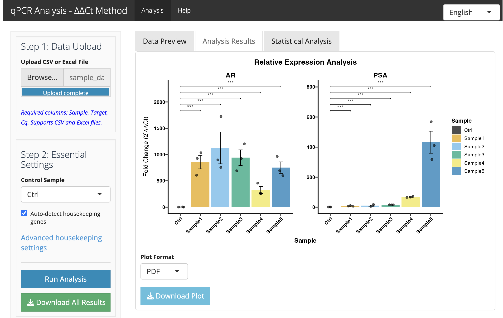
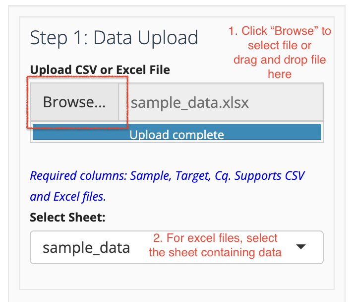
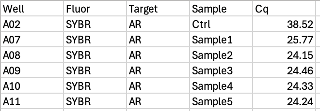
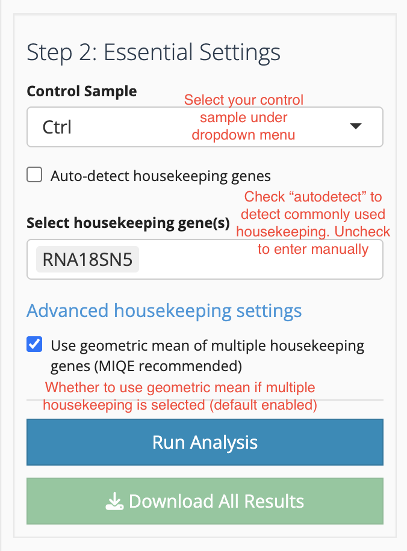
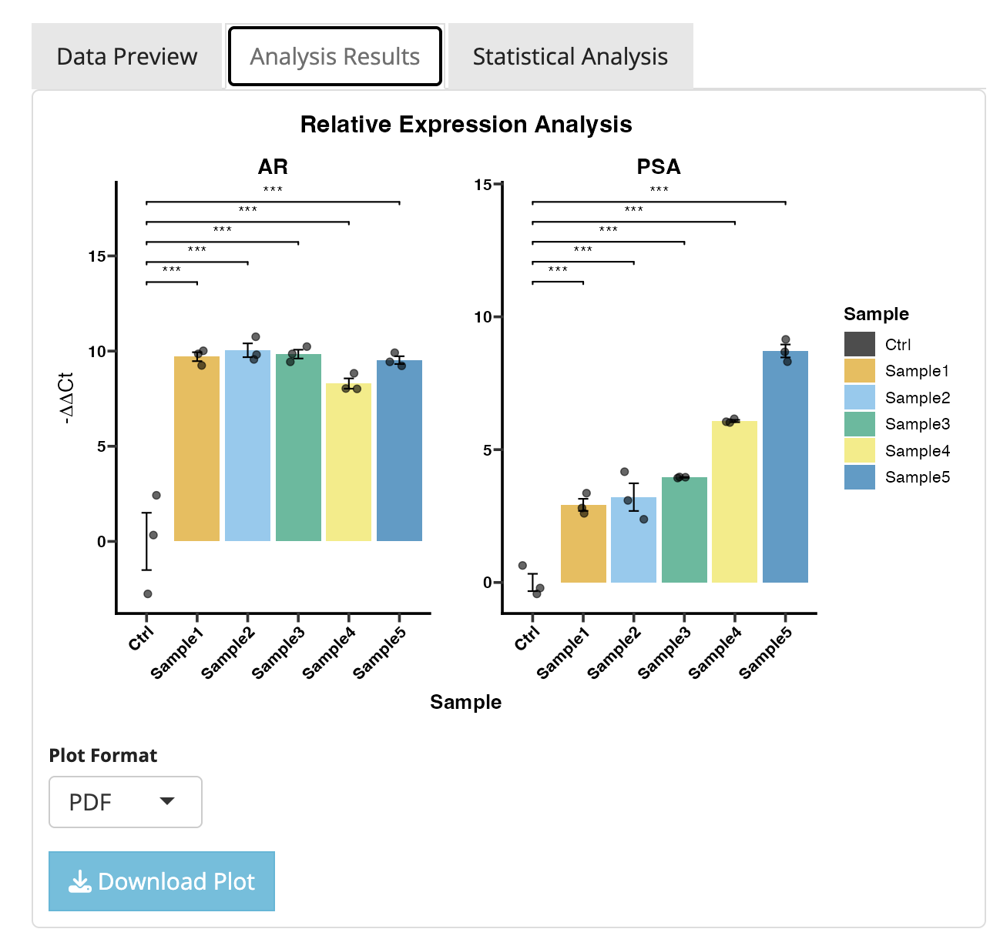
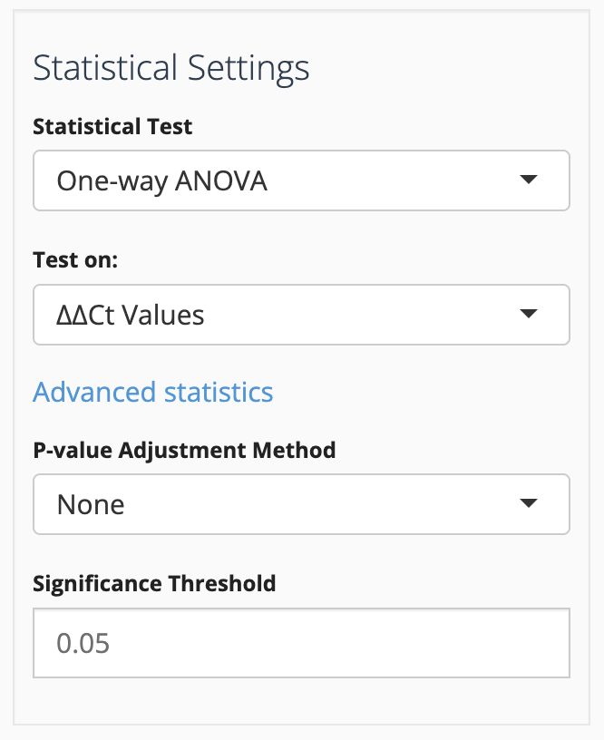
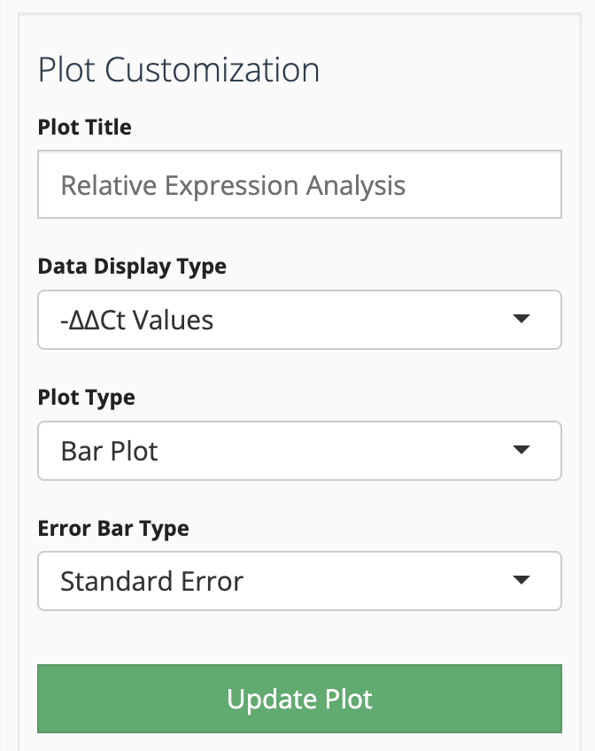
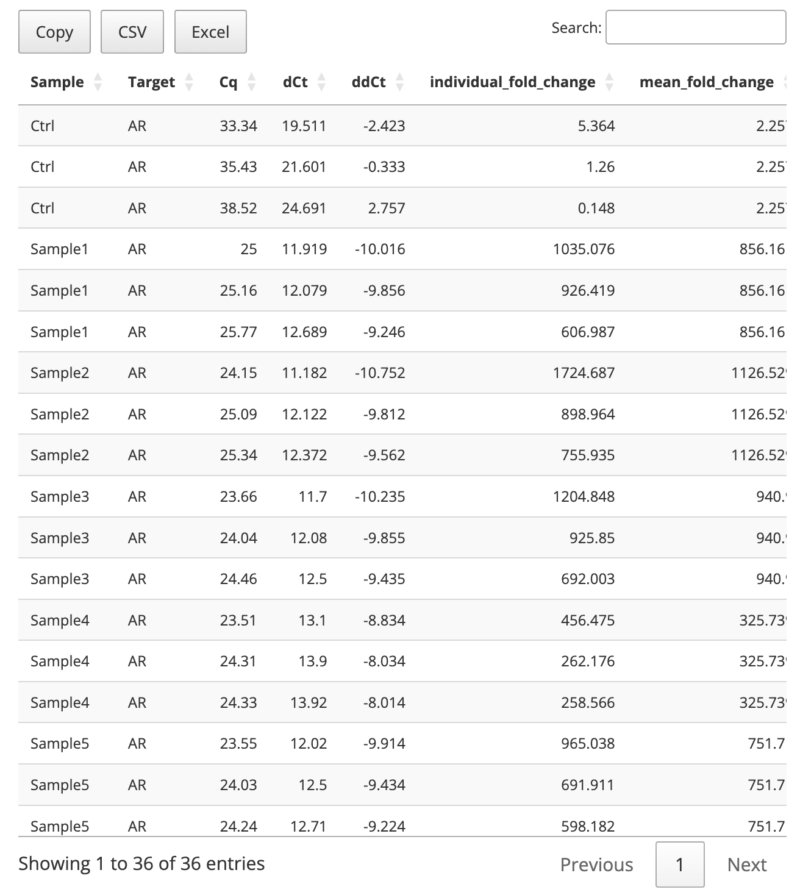

# qPCR Analysis Tool - ΔΔCt Method

A comprehensive Shiny application for qPCR data analysis and visualization using the ΔΔCt method with MIQE-compliant statistical analysis.



# Major Update 09/05/2025 - Fixed Statistical Methods, UI improvements  
- Statistical analysis now run on ddCt by default. Users can choose to run on dCt/ddCt.
- Added post-hoc tests for Kruskal-Wallis
- Added more p adjustment methods, e.g. FDR.
- Used "yeti" theme for a cleaner, more modern UI.
- Added Chinese translation (UI only)! Users can now switch languages in the upper right corner.
- Folded advanced settings for a cleaner UI.
- Added options to visualize results in -ddCt, ddCt, -dCt and dCt.

## Features

### **Comprehensive Analysis**
- **ΔΔCt Method**: Standard relative quantification analysis
- **Statistical Analysis**: One-way ANOVA and Kruskal-Wallis tests with multiple correction methods
- **Quality Control**: CV analysis, outlier detection, and data validation
- **Multiple Plot Types**: Bar, box, violin, and beeswarm plots with extensive customization

### **User Experience**
- **Bilingual Support**: English and Chinese interface with dynamic language switching
- **Interactive Data Editing**: Edit individual data points and exclude outliers with full tracking
- **Publication-Ready Plots**: 13+ color palettes including colorblind-friendly and journal themes
- **Comprehensive Export**: Complete analysis results, plots, and modification history in ZIP format

###  **Data Import & Format**
- **Multiple Formats**: CSV and Excel (.xlsx, .xls) with sheet selection
- **Automatic Validation**: Data format checking and error reporting
- **Flexible Input**: Supports various column naming conventions



## Quick Start

### Step 1: Data Upload
Upload your qPCR data file containing these required columns:
- **Sample**: Sample identifiers  
- **Target**: Gene names
- **Cq**: Quantification cycle values (0-40)
- **Well**: PCR well locations (optional but recommended)



### Step 2: Configure Settings
Set your control sample and housekeeping genes (auto-detection available):



### Step 3: Review Results
Analyze your data with comprehensive statistical analysis and publication-ready plots:



## Installation

### Local Installation
```bash
git clone https://github.com/mianaz/qpcr_tool.git
cd qpcr_tool
```

### Required R Packages
```r
# Install all required packages
install.packages(c(
  # Core Shiny
  "shiny", "shinythemes", "shinyjs", "DT", "sortable",
  
  # Analysis
  "tidyverse", "ggplot2", "rstatix", "gridExtra",
  
  # Plotting
  "ggprism", "ggsignif", "viridis", "ggsci", "ggthemes", "ggbeeswarm",
  
  # File handling
  "openxlsx"
))
```

### Run the Application
```r
# Option 1: Using app.R
source("app.R")
shiny::runApp()

# Option 2: Direct execution
shiny::runApp(".")
```

## Sample Data

The repository includes sample data files for testing:
- `sample_data.csv` - CSV format example
- `sample_data.xlsx` - Excel format example

## Advanced Features

### Statistical Analysis
Configure your preferred statistical methods and significance thresholds:



### Plot Customization
Extensive customization options for publication-ready figures:



### Data Tables
Interactive tables with export functionality:



## Deployment

### Shiny Server
```r
library(rsconnect)
rsconnect::setAccountInfo(name='your_account', token='TOKEN', secret='SECRET')
rsconnect::deployApp("path/to/qpcr_tool/")
```

### Online Access
A hosted version is available at: [https://apps.bioinfospace.com/qpcr-analysis/](https://apps.bioinfospace.com/qpcr-analysis/)

## Citation

If you use this tool in your research, please cite:

```
qPCR Analysis Tool v2.0 - ΔΔCt Method. 
GitHub: https://github.com/mianaz/qpcr_tool
```

**BibTeX:**
```bibtex
@software{qpcr_analysis_tool_2024,
  title={qPCR Analysis Tool v2.0 - ΔΔCt Method},
  author={mianaz},
  year={2024},
  url={https://github.com/mianaz/qpcr_tool},
  note={Comprehensive Shiny application for qPCR data analysis and visualization}
}
```

## Data Privacy & Security

### **Data Protection**
- **No Permanent Storage**: Your data is processed temporarily on the server and never permanently saved or stored
- **Session Isolation**: Each user operates in an isolated R session, completely separate from other users
- **Temporary Processing**: Files are processed in server memory and temporary storage during your session only
- **Automatic Cleanup**: All data, files, and results are automatically cleared when your session ends

### **Session Management**
- **Independent Sessions**: Each user has their own isolated processing environment on the server
- **Session Lifecycle**: Your data exists only during your active browser session
- **Memory Cleanup**: Server memory is automatically freed when your session terminates
- **Fresh Start**: Refresh your browser to start a new analysis (previous results will be cleared)

### **Important Notes**
- **Save Your Work**: Download results before closing your browser or starting fresh
- **Session Timeout**: Extended inactivity will automatically end your session and clear data
- **No Data Retention**: We do not retain, backup, or store your analysis data
- **Sensitive Data**: Each session is isolated, but consider local installation for highly sensitive research

## License

MIT License - see [LICENSE](LICENSE) file for details.

## Acknowledgments

09/05/2025 - Many thanks to @Emberwhirl for pointing out statistical issues in previous versions and suggestions for new features.

